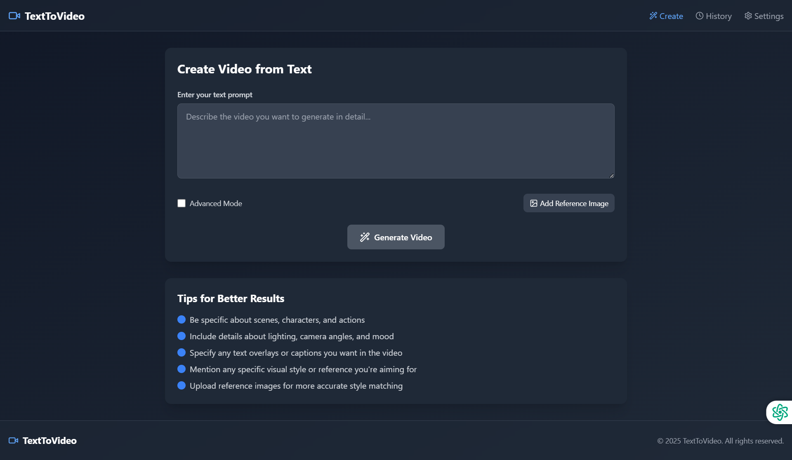

# TextToVideo Converter



## Overview

TextToVideo is a powerful web application that converts text descriptions into high-quality videos. Simply describe the video you want to create, and our advanced AI will generate it for you - no API or complex setup required.

## Features

### Core Functionality
- **Text-to-Video Generation**: Transform your text descriptions into fully realized videos
- **Reference Image Support**: Upload images to guide the style and content of your generated videos
- **Advanced Customization**: Fine-tune your videos with detailed controls


### Advanced Controls
- **Video Style**: Choose from multiple styles including Realistic, Animated, 3D Rendered, Cinematic, Artistic, Noir, Vintage, and Sci-Fi
- **Aspect Ratio**: Select from standard formats (16:9, 4:3, 1:1, 9:16, 21:9)
- **Duration**: Set custom video lengths from 15 seconds to 2 minutes
- **Frame Rate**: Choose between 24fps, 30fps, or 60fps
- **Color Grading**: Apply different color profiles to match your creative vision
- **Audio**: Add ambient or themed background tracks
- **Text Overlay**: Include captions or titles directly in your videos

### Management Features
- **Video History**: Access all your previously generated videos
- **Download Options**: Save your videos in various formats
- **Edit & Regenerate**: Refine your videos after generation

## 🚀 [Live Demo](https://texttovideogui.netlify.app/)

## Getting Started

### Prerequisites
- Node.js 18.0 or higher
- npm or yarn

### Installation

1. Clone the repository:
```bash
git clone https://github.com/ShiboshreeRoy/TextToVideo-Converter.git
cd TextToVideo-Converter
```

2. Install dependencies:
```bash
npm install
```

3. Start the development server:
```bash
npm run dev
```

4. Open your browser and navigate to `http://localhost:5173`

## Usage Guide

### Basic Video Generation

1. Enter a detailed description of the video you want to create
2. Click "Generate Video"
3. Wait for the generation process to complete
4. Preview, download, or further edit your video


### Advanced Video Generation

1. Toggle "Advanced Mode"
2. Enter your text description
3. Optionally upload a reference image
4. Configure your desired settings:
   - Select video style
   - Choose aspect ratio
   - Set duration and frame rate
   - Apply color grading
   - Add audio track if desired
   - Enable text overlay if needed
5. Click "Generate Video"
6. Review, download, or edit the result

## Tips for Better Results

- Be specific about scenes, characters, and actions
- Include details about lighting, camera angles, and mood
- Specify any text overlays or captions you want in the video
- Mention any specific visual style or reference you're aiming for
- Upload reference images for more accurate style matching

## Technology Stack

- **Frontend**: React, TypeScript, Tailwind CSS
- **UI Components**: Custom components with Lucide React icons
- **State Management**: React Hooks
- **Styling**: Tailwind CSS with custom gradients

## Contributing

Contributions are welcome! Please feel free to submit a Pull Request.

1. Fork the repository
2. Create your feature branch (`git checkout -b feature/amazing-feature`)
3. Commit your changes (`git commit -m 'Add some amazing feature'`)
4. Push to the branch (`git push origin feature/amazing-feature`)
5. Open a Pull Request

## License

This project is licensed under the MIT License - see the LICENSE file for details.

## Acknowledgments

- [Lucide Icons](https://lucide.dev/) for the beautiful icon set
- [Tailwind CSS](https://tailwindcss.com/) for the styling framework
- [React](https://reactjs.org/) for the frontend framework

---

© 2025 TextToVideo. All rights reserved.